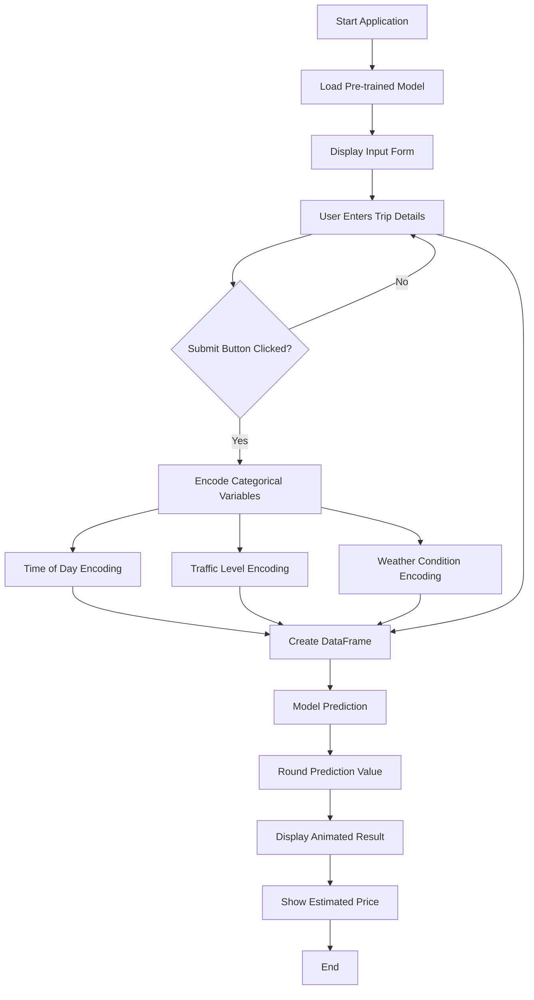
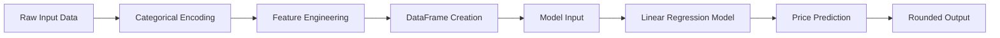

# Taxi Price Prediction System

A machine learning-based taxi fare prediction application that estimates trip costs based on various factors including distance, traffic conditions, weather, and time of day. Built with Python and deployed as an interactive web application using Streamlit.

## Table of Contents

- [Features](#features)
- [Workflow](#workflow)
- [Input Parameters](#input-parameters)
- [Tech Stack](#tech-stack)
- [Installation](#installation)
- [Usage](#usage)
- [Model Details](#model-details)
- [Project Structure](#project-structure)

## Features

- Real-time Price Prediction: Instant fare estimates based on trip parameters
- Interactive Web Interface: User-friendly Streamlit dashboard with custom styling
- Multi-factor Analysis: Considers distance, passenger count, traffic, weather, time of day, and pricing rates
- Animated Results Display: Eye-catching pulse animation for prediction results
- Machine Learning Model: Linear regression model trained on historical taxi trip data

## Workflow

The following diagram illustrates the complete workflow of the taxi price prediction system:



## Data Processing Workflow



## Input Parameters

The application accepts the following input parameters:

| Parameter | Type | Options/Range |
|-----------|------|---------------|
| Trip Distance | Number | Kilometers |
| Number of Passengers | Number | Integer value |
| Time of Day | Select | Morning, Afternoon, Evening, Night |
| Traffic Conditions | Select | Low, Medium, High |
| Weather Conditions | Select | Clear, Rain, Snow |
| Base Fare | Number | Currency value |
| Per Kilometer Rate | Number | Currency value |
| Per Minute Rate | Number | Currency value |
| Trip Duration | Number | Minutes |

## Tech Stack

- **Python**: Core programming language
- **Streamlit**: Web application framework for interactive UI
- **Pandas**: Data manipulation and analysis
- **Scikit-learn**: Machine learning model (Linear Regression)
- **Pickle**: Model serialization and deserialization

## Installation

### Prerequisites

- Python 3.7 or higher
- pip package manager

### Setup Instructions

1. Clone the repository:
```bash
git clone https://github.com/amirtha-1412/TAXI_PRICE_PRED.git
cd TAXI_PRICE_PRED
```

2. Install required dependencies:
```bash
pip install streamlit pandas scikit-learn
```

3. Ensure the following files are present:
   - `app.py` - Main application file
   - `model_linear.pkl` - Pre-trained model
   - `car.png` - Application banner image
   - `taxi_trip_pricing.csv` - Training dataset

## Usage

1. Start the Streamlit application:
```bash
streamlit run app.py
```

2. Open your web browser and navigate to the provided local URL (typically `http://localhost:8501`)

3. Enter the required trip details in the input form

4. Click the "Submit" button to get the estimated taxi fare

5. View the animated prediction result displayed on the screen

## Model Details

### Algorithm

The prediction model uses **Linear Regression** from scikit-learn, which establishes a linear relationship between input features and the target variable (taxi fare).

### Feature Encoding

Categorical variables are encoded as follows:

**Time of Day:**
- Morning: 1
- Afternoon: 2
- Evening: 3
- Night: 4

**Traffic Conditions:**
- Low: 1
- Medium: 2
- High: 3

**Weather Conditions:**
- Clear: 1
- Rain: 2
- Snow: 3

### Training Data

The model is trained on historical taxi trip pricing data (`taxi_trip_pricing.csv`) containing various trip parameters and their corresponding fares.

## Project Structure

```
TAXI_PRICE_PRED/
│
├── app.py                      # Main Streamlit application
├── model_linear.pkl            # Trained Linear Regression model
├── taxi_trip_pricing.csv       # Training dataset
├── car.png                     # Application banner image
├── AMIRTHA_EDA.ipynb          # Exploratory Data Analysis notebook
└── README.md                   # Project documentation
```

## Model Training

The model was trained using the following steps:

1. Data collection and preprocessing
2. Exploratory Data Analysis (EDA)
3. Feature engineering and encoding
4. Model training using Linear Regression
5. Model evaluation and validation
6. Model serialization using pickle

## Future Enhancements

- Integration of additional ML algorithms (Random Forest, Gradient Boosting)
- Real-time traffic data integration via APIs
- Historical price trend visualization
- User authentication and trip history tracking
- Mobile-responsive design improvements
- Deployment to cloud platforms (Heroku, AWS, Azure)

## Contributing

Contributions are welcome! Please feel free to submit a Pull Request.


**Note:** This is an educational project demonstrating machine learning application in real-world scenarios. Actual taxi pricing may vary based on additional factors not included in this model.
